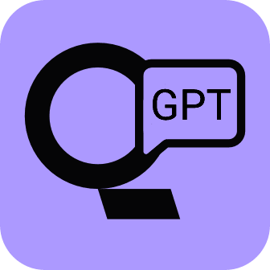

#  ChatGPT Online for Google

A browser extension to display ChatGPT response alongside Google with connected results

<!-- [Install from Chrome Web Store](https://chrome.google.com/webstore/detail/chatgpt-for-qwant/fmackbdncigkggigfkmiikcpobkeijaf)

[Install from Mozilla Add-on Store](https://addons.mozilla.org/firefox/addon/chatgpt-for-qwant/) -->

## Screenshot

## Features

- Select your number of web results to use for answers 
- Supports the official OpenAI API (add new model ChatGPT-3.5-turbo !!!)
- Supports ChatGPT Plus
- web-connected (Chat gpt online is only connected to Google)
- Supports all popular search engines (Google, Qwant, Duckduckgo, yahoo, baidu ....)
- Markdown rendering
- Code highlights
- Dark mode
- Provide feedback to improve ChatGPT
- Copy to clipboard
- Custom trigger mode
- Switch languages

## Troubleshooting

### How to make it work in Brave

Disable "Prevent sites from fingerprinting me based on my language preferences" in `brave://settings/shields`

## Build from source

1. Clone the repo
2. Install dependencies with `npm`
3. `npm run build`
4. Load `build/chromium/` or `build/firefox/` directory to your browser

## Credit

This project is inspired by [wong2/chat-gpt-google-extension](https://github.com/wong2/chat-gpt-google-extension)
